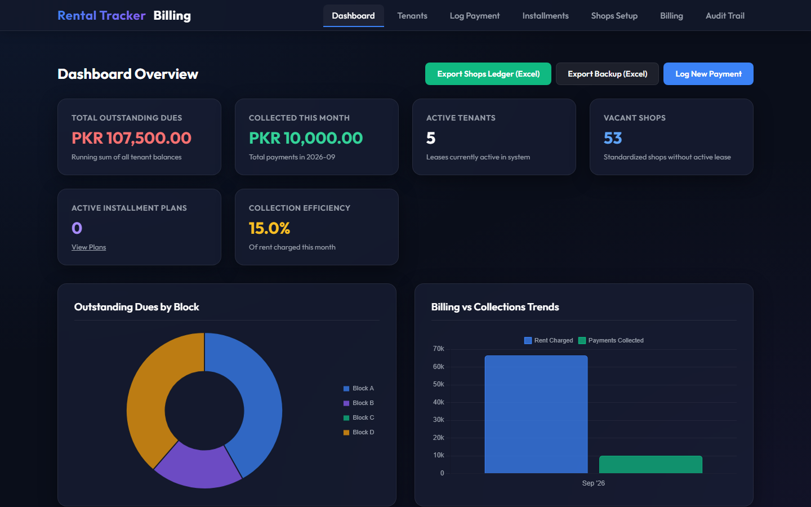
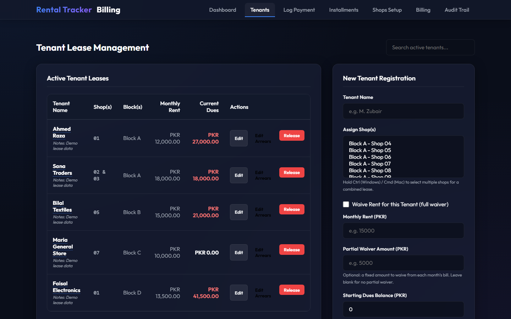
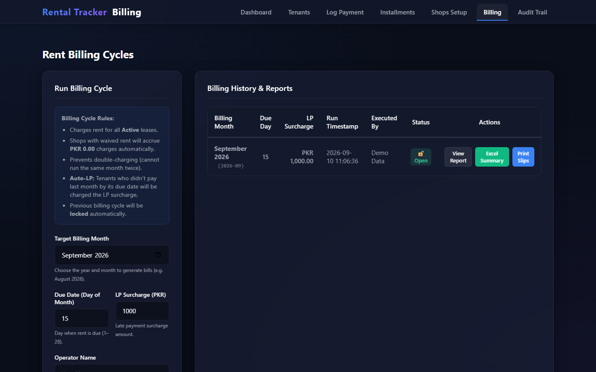
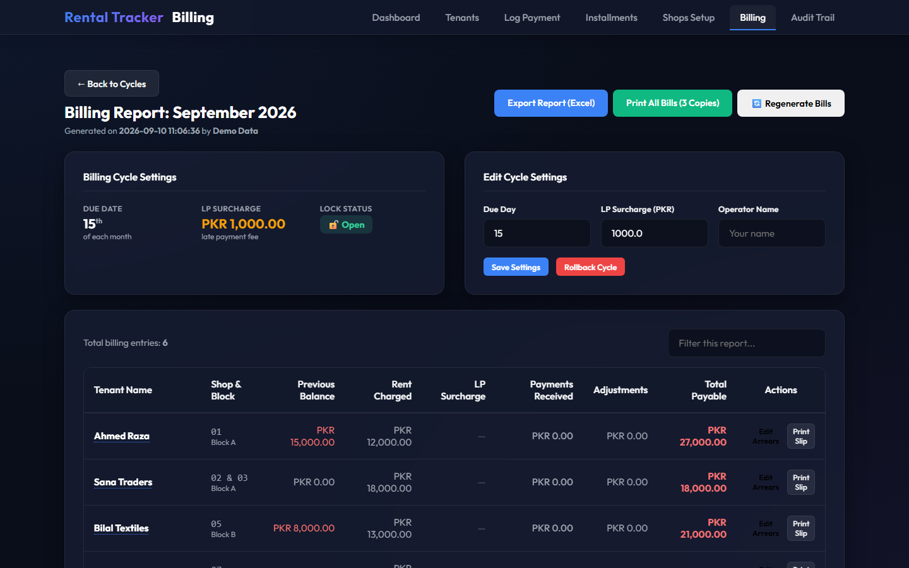
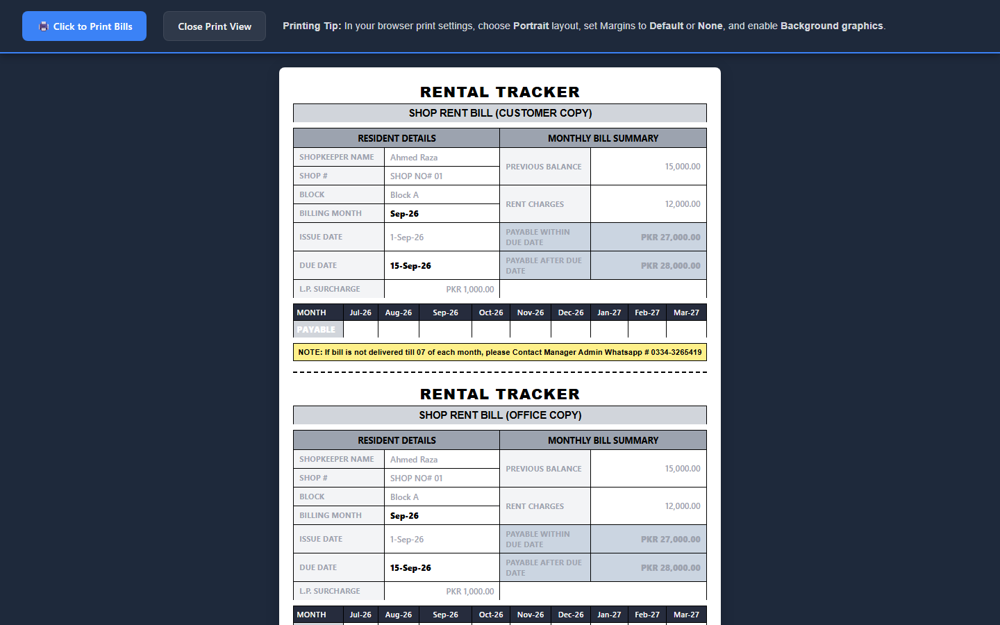
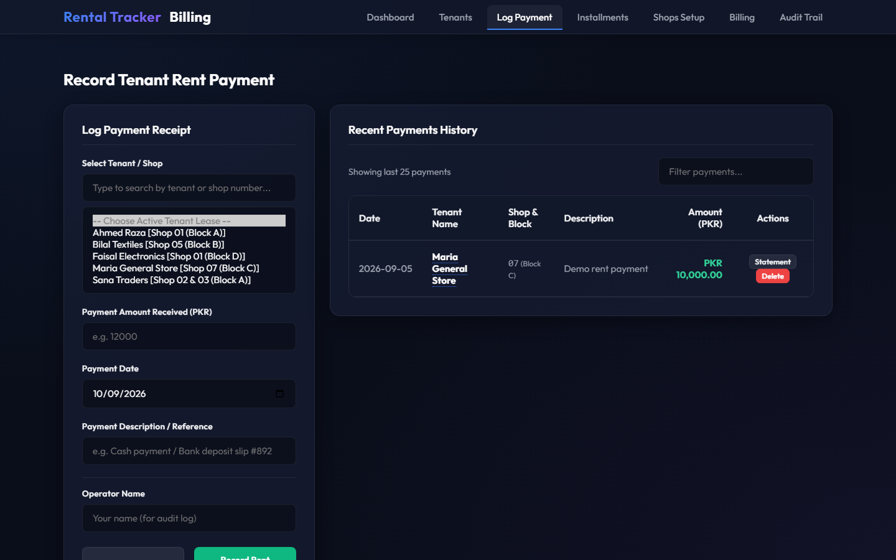

# 🏢 Rental Tracking App

A complete **commercial property rent & billing management system** built with Flask. Designed for estate agencies, property managers, and owners of multi-shop commercial buildings — it replaces messy Excel sheets and paper registers with a clean, automated ledger.

From **tenant onboarding** to **monthly billing**, **payment tracking**, **arrears recovery**, and **print-ready bills**, everything a rent collector needs is in one local app.

---

## ✨ Features

- **Tenant & Lease Management** — register tenants, assign one or multiple shops/blocks, waive or partially waive rent, and keep notes & arrears per tenant.
- **Automated Monthly Billing** — generate a full billing cycle with one click, including previous balances, rent charges, payments, adjustments, and late-payment surcharges.
- **Payment Logging** — record payments instantly with an audit trail of who logged what and when; delete mistaken entries with confirmation.
- **Billing Cutoffs** — mark a shop inactive with a date, so a month's bill is **not** generated if the shop left before the month started; inactive shops still carrying dues keep receiving bills until cleared.
- **Print-Ready Bills** — print professional A4 slips with **Customer / Office / Bank** copies, a previous-balance summary, monthly tracker (MONTH / PAYABLE strip), due dates and surcharge breakdown.
- **Tenant Statements** — per-tenant ledger with full transaction history.
- **Installment Plans** — split special arrangements into managed installments.
- **Audit Trail** — every action (charge, payment, waiver, override, deletion) is recorded with performer name and timestamp.
- **Excel Exports** — export balances, full ledgers, and audit logs for accountants.
- **Local LAN Access** — run once, and the office can access it from any connected device.

## 🛠 Tech Stack

| Layer      | Technology |
|------------|------------|
| Backend    | Python 3.9+, Flask |
| Database   | SQLite (SQLAlchemy ORM, auto-created on first run) |
| Frontend   | Jinja2 templates, vanilla JavaScript, Chart.js |
| Production | Waitress WSGI server |
| Exports    | openpyxl (Excel) |

## 🚀 Quick Start

```bash
# 1. Clone the repository
git clone https://github.com/amaanyousaf123-ops/rental-tracking-app.git
cd rental-tracking-app

# 2. (Optional) Create & activate a virtual environment
python -m venv .venv
.venv\Scripts\activate        # Windows
source .venv/bin/activate     # Linux / macOS

# 3. Install dependencies
pip install -r requirements.txt

# 4. Run the app
python app.py
```

Open **http://localhost:5000** in your browser. On first launch the database, blocks, and shops are created automatically.

> 💡 On Windows you can also just double-click `start.bat` — it finds/installs Python, creates the virtual environment, runs the test suite, and launches the server automatically.

## 🧪 Tests

```bash
python test_billing.py
```

Runs the full suite covering billing generation, waivers, arrears overrides, late-payment surcharges, rollbacks, and statement calculations.

## 📂 Project Structure

```
rental-tracking-app/
├── app.py                  # Flask routes & business logic
├── models.py               # Database models (Lease, Shop, Transaction, AuditLog, ...)
├── database.py             # DB initialization & auto-migrations
├── utils.py                # Excel exports & helper utilities
├── requirements.txt
├── start.bat               # One-click Windows launcher
├── templates/              # Jinja2 HTML templates
├── static/                 # CSS & JavaScript
└── test_billing.py         # Billing logic test suite
```

## ⭐ Real-World Testimonial

> *"We were running our entire rent collection on a maze of Excel sheets — duplicate entries, lost payment slips, and every month-end we'd spend two full days reconciling who owed what. Tenants would argue about payments from three months ago and we had no clean record to show them.*
>
> *The Rental Tracking App changed all of that in the first week. Billing went from two days of manual copying to a single click per month. The printed bill slips with the monthly tracker settled tenant disputes instantly — when someone says they paid, we print their statement on the spot. The audit trail caught a clerk who had quietly mislogged a payment, and the inactive-shop billing cutoff saved us from wrongly charging shops that had already closed.*
>
> *Today we manage 60+ commercial shops from one laptop, and month-end reconciliation takes under an hour. This app literally paid for itself in the first billing cycle."*
>
> — **M. Hassan**, Owner, multi-market commercial complex (60+ shops)

## 📸 Screenshots

| | |
|---|---|
| **Dashboard** — at-a-glance collections, dues & monthly stats | **Tenants** — active lease management with dues per shop |
|  |  |
| **Billing** — monthly cycle generation with due-day & surcharge settings | **Billing Details** — per-tenant bill breakdown (balance, rent, payments, LP fee) |
|  |  |
| **Printed Bill Slip** — Customer/Office/Bank copies with monthly tracker | **Log Payment** — quick-pay with live outstanding-dues display |
|  |  |

## 📄 License

This project is licensed under the **MIT License** — free to use and modify.

---

Built with ❤️ as a portfolio project — clean, documented, and production-tested.